# The optimizer's architecture, after GCC's

Branch `gcc-scheme`, session 1 (Fable 5.1, 2026-09-24). This is the class
diagram the reorganization left, what each class is for, how the pipeline is
declared, how a pass is added, how properties and invalidation work, and how
the levels and costs work. Where it came from is `docs/GCC-SOURCE-STUDY.md`;
what is built on it next is `docs/HANDOVER-SESSION-2.md`. Everything here
emits, byte for byte, what branch `opt` at `c615195` emitted
(`tools/identical.sh`, 2,424 outputs).

## 1. The diagram

```mermaid
classDiagram
    class Spelling { <<interface>> ins() defLabel() prologue() ... }
    class Optimizer {
        -Function fn_
        -unique_ptr~Pass~ pipeline_
        -PassManager manager_
        +ins() defLabel() stateLabel() functionBegin() functionEnd() prologue()
        +frame() temporaries() inlineBegin() inlineEnd() jumpOnly() exceptionRegion() returnsPair() settle()
        -improve() flush()
    }
    Spelling <|-- Optimizer
    Optimizer --> Spelling : under_ (the real spelling)

    class Function {
        +string name
        +Stream stream
        +Convention convention
        +Costs costs
        +Flow flow
        +unsigned props
        +locals promotable whole jumpOnly tempFrom tempBase tempCount
        +prologueAt frameSize inlineTop lsda outgoing saves size
        +regions : Region[]
        +frameBase() has() buildFlow() loops()
    }
    class Loops { count() all() depthOf(block); -bodyOf() }
    Function *-- Loops : loops_, on request
    Loops ..> Flow : dominators()
    class Region { begin end target }
    Function *-- Region
    Optimizer *-- Function

    class Costs {
        <<abstract>>
        +level() forSize() rounds() registers() minWeight() stringCopies()
        +inlines() inlineGrowth(depth) callerGrowthPercent() unitGrowthPercent() largeFunction()
        +forLevel()$
    }
    Costs <|-- SizeCosts
    Costs <|-- SpeedCosts
    Function --> Costs : costs()
    Optimizer *-- Costs : costs_

    class Inliner {
        -measures_ decided_ unitSize_ unitTaken_ largestFrame_
        +summarize(Program) eligible(callee) allows(site) largestFrame()
        -sitesOf() sortByBadness() withinBudgets() charge()
    }
    Inliner --> Costs
    X86_64Linux *-- Inliner : inliner_

    class Flow {
        +vector~Block~ blocks
        +vector~Edge~ edges
        +vector~Effects~ effects
        +solutionsDirty dominated
        +build() live() touch() solve() dominators() dominates()
        +succBlocks() predBlocks() blockOf() joinPads()
    }
    class Block { begin end succs preds leaves in out idom }
    class Live { regs wide flags; step(Effects) join(Live) }
    Block *-- Live : in, out
    class Edge { from to kind : Fallthrough|Jump|Return|Leave|Eh; at }
    Function *-- Flow
    Flow *-- Block
    Flow *-- Edge

    class ReachingDefs { +in[block][reg]; solve(flow, stream, lastDef, unknownIn) }
    Flow <.. ReachingDefs : solved over

    class Opcode { name kind flags width; has() }
    class Effects { reads writes partial wide flags* memory* control stack opaque }
    Opcode <.. Effects : effectsOf() rolesOf() read the table

    class Pass {
        <<abstract>>
        +PassInfo info : name required provided destroyed todoStart
        +gate(Function) bool
        +execute(Function) bool
    }
    class Group { subs repeat stop : WhenNoneChanged|WhenFirstUnchanged }
    Pass <|-- Group
    Group o-- Pass : subs
    class PassManager { run(Pass, Function); before() after() runLeaf() runGroup(); dump }
    PassManager ..> Pass
    PassManager ..> Function
    Optimizer *-- PassManager

    Pass <|-- ForwardValues
    Pass <|-- RemoveUnreachable
    Pass <|-- RemoveDead
    Pass <|-- CoalesceCopies
    Pass <|-- FoldLoads
    Pass <|-- FoldOffsets
    Pass <|-- ThreadJumps
    Pass <|-- DivideByConstant
    Pass <|-- FoldIndex
    Pass <|-- HoistInvariants
    Pass <|-- WebsPass
    class Webs {
        -fn_ home_ pinned_ sets_ occ_ defAt_ implicitDef_ useWeb_ unknownIn_
        +splitPinned() build() homes() count() pinned() assign(colour) dropSelfCopies()
        -occurrencesOf() implicitReads() implicitWrites() makeDefinitions() joinUsesToDefinitions() renameToPseudos()
    }
    WebsPass ..> Webs
    Webs --> Function
    Webs ..> ReachingDefs
    Pass <|-- LocalsPass
    class Locals { +promote() }
    LocalsPass ..> Locals
    Locals ..> promotableLocals
    Pass <|-- Allocate
    class Allocator {
        -fn_ homes_ nHomes_ uses_ liveIn_ liveOut_ nodes_ matrix_ copies_ colour_ demoted_ offered_ taken_ freshFor_
        +run() coalesced() fellBack()
        -findUses() solveLiveness() buildInterference() collectCosts() valid()
        -colour() coalesce() reserveFresh() simplify() select() pick() merge() significant() bestPreference()
        -demote() addSaves()
    }
    Allocate ..> Allocator
    Allocator --> Function
    Allocator ..> Loops : depthOf
    Allocator ..> Costs : referenceWeight loopWeight registers minWeight
    Pass <|-- RemoveDeadStores
    Pass <|-- FinishFrame
    Pass <|-- Shrink
    Group <|-- Rounds
    Group <|-- RoundsIfPromoted
    Group <|-- FrameGroup
```



Files, all under `src/backend/`:

| File | Holds |
|---|---|
| `OptTable.{h,cpp}` | `Opcode`, `opcodeOf`, the move families, `conditionOf`/`inverse` |
| `OptIr.{h,cpp}` | `Reg`, `Operand` (a memory operand carries an index register and a scale since session 7), `Instr`, `Entry`, `Stream` |
| `OptEffects.{h,cpp}` | `Effects`/`Roles` of one instruction from the table; `Convention` |
| `OptCore.h` | `RegSet`, `Effects`, `Control`, `Region`, `EntryOf`, `Edge`, `Live`, `Block`, `FlowOf` (build, liveness, dominators), `removeDeadIn`, `removeUnreachableIn` |
| `OptFlow.{h,cpp}` | `controlOf` for x86; `Flow` = `FlowOf<Entry>` with the x86 effects |
| `OptDataflow.{h,cpp}` | `ReachingDefs` |
| `OptLoops.{h,cpp}` | `Loops`: the natural loops from the dominators |
| `OptCosts.h` | `Costs`, `SizeCosts`, `SpeedCosts` |
| `Inliner.{h,cpp}` | `Inliner`: which calls the walker walks in place, by the costs' budgets |
| `OptFunction.h` | `Prop`, `Function` |
| `OptPass.{h,cpp}` | `Todo`, `PassInfo`, `Pass`, `Group`, `PassManager`, `dropUnnamedLabels`, `dumpStream` |
| `OptPipeline.{h,cpp}` | the `Pass` subclasses and `pipelineFor()` |
| `OptPasses.h`, `OptValues.cpp`, `OptDead.cpp`, `OptMemory.cpp`, `OptFrame.cpp`, `OptShrink.cpp` | the pass algorithms as free functions; `OptFrame.cpp` holds `promotableLocals`, `insertRestores`, `dropUnusedSaves` and the frame's shared slots; `OptMemory.cpp` holds `fold-index` beside the two older folds |
| `OptJumps.cpp` | `threadJumps`: a jump to a block that only jumps on, and a constant that decides the compare-and-branch it reaches (session 7) |
| `OptDivide.cpp` | `divideByConstant`: a 32-bit divide by a constant as a multiply by its magic number, -O2 only (session 7) |
| `OptHoist.cpp` | `hoistInvariants`: loop-invariant code motion after allocation, into registers the loop leaves free (session 8) |
| `Mir.h`, `MirWebs.cpp` | `mir::Webs`: pinned occurrences split by copies, webs to pseudos; `assign` and `dropSelfCopies` for whoever colours |
| `MirLocals.{h,cpp}` | `mir::Locals`: every promotable scalar local renamed to a pseudo, its slot kept |
| `MirAlloc.{h,cpp}` | `mir::Allocator`: liveness and interference over the pseudos, Chaitin-Briggs colouring with the copies as preferences, preserved registers charged their save, a local's slot given back where no register can hold it |
| `Optimizer.{h,cpp}` | the Spelling that holds a function, runs the pipeline, replays |

## 2. Each class, and what it is responsible for

**`Optimizer`** (a `Spelling`). Stands in front of the real spelling for -O1
and -O2. Holds every call between `functionBegin` and `functionEnd` as an
`Entry` of the `Function`'s stream - an instruction, a label (with the
state mark), or an *event* (any other spelling call, replayed where it
stood). Takes what the walker says of the function (`frame`, `inlineBegin`,
`jumpOnly`, `returnsPair`, `prologue`, and since session 6 `temporaries`).
At `functionEnd`, or at `settle`
(the walker about to cut a funclet), `flush` runs the pipeline and replays
the surviving entries. Nothing else: no pass logic lives here any more.

**The walker's temporaries** (session 6, S7). The walker is a stack
machine, and an operand held across the evaluation of another went through
`push` and `pop` - across a call, `push %rax; sub $8, %rsp ... add $8,
%rsp; pop %rdi`. Where the optimizer holds the function and no funclet
reads the frame (`X86_64Linux::tempsInSlots`: never at -O0, never in a
function with Microsoft funclets), `push()`/`pop()` and `pushF()`/`popF()`
write and read a **frame slot** instead, so `depth_` counts the real stack
alone and every pad, the atFloor decision, the unwind codes and the CFI
stay the walker's own; a stack argument keeps a real push (`pushArg`,
`pushFArg`) for the call to unwind. The slots are one LIFO stack per
function, an inlined callee continuing it, addressed at
`-(Optimizer::kTempBase + 8(t+1))` (2^40) while the walk runs;
`Optimizer::instruction` leaves such an operand out of the inlined
callee's shift. Once the walk is done `Optimizer::temporaries(count)`
places the region below `frameBase()` - below every local and every
inlined frame, so a temporary never shares an address with an object whose
address is taken (the first version interleaved them and read an inlined
callee's object through a temporary's pseudo) - rewrites the displacements,
appends each slot to `Function::locals` and records `tempFrom`, `tempBase`
and `tempCount`. From there an integer slot is a local to `mir::Locals`
and a pseudo to the allocator; an xmm slot stays a slot (xmm accesses are
not promotable) but has no `rsp` traffic. The choice against rewriting
push/pop pairs in a pass: a pass would have had to re-derive the alignment
pad and the atFloor decision of every call the pair spanned.

**`Function`.** GCC's `struct function` + `cfg` + `curr_properties`. The
stream, the convention, the costs, the flow, the properties, and the frame
facts (as walked, `frameSize`; as grown by inlined callees, `inlineTop`; as
the passes leave it, `saves` and `size`). `frameBase()` is where the passes
may add slots. A pass reads and writes the function; the manager reads and
writes `props`.

**`Costs`.** The level, as the questions a pass asks of it (section 6):
one interface, `SizeCosts` for -O1 and `SpeedCosts` for -O2. The
`Optimizer` owns the one it was made with; `Function::costs()` hands it to
the passes.

**`Inliner`.** Which calls are walked in place of a call instruction -
GCC's `ipa-inline` reduced to what the walker knows before it walks. Owned
by the walker, made only when the costs say the level inlines. `summarize`
measures every function of the unit once (AST nodes; whether a body is
safe to walk in place at all: no landing pad, no cleanup on unwind, not
variadic, no register save area), lists every site with the loops it sits
in and its growth (the callee's size less the call it replaces), and
decides them all in badness order - the least growth for the deepest loop
first, as GCC's queue - against three budgets the costs set, per site by
loop depth, per caller and per unit, charging each site admitted to its
caller and to the unit; `allows` answers for a site from that;
`largestFrame` is what a funclet-cut caller reserves. Since session 8 a
function's call of itself is a site like any other: the walker's `inPlace_`
refuses a call inside a body walked in place, so a recursive function is
walked into itself exactly one level deep (fib 13 to 11 ms). And the inlined
callee's scalars are listed for promotion, moved down by the base as its
operands are (`Optimizer::inlineBegin`): the region every site shares is
still one region, but a slot in it is offered a register where every access
is whole and alike, and `promotableLocals` refuses the rest as it refuses any
two overlapping accesses.

**`Flow`** (`FlowOf<Entry>`). The CFG and the scanning layer: `build`
splits the stream into `Block`s at labels and after control instructions,
computes `effects` per entry from the opcode table (a call's reads are the
argument registers the walker's plan filled, `Instr::args`, told through
`Optimizer::callArguments` just before it; a call issued by hand says
nothing and reads the convention's whole set), and makes the `Edge`s -
jump, fallthrough, return, leave, and `Eh` from every call a `Region`
covers to the block of the region's target (the landing pad, or where the
function resumes after a handler ran as a funclet). GCC ends a block at
such a call; here the call stays in its block - a split would take from
the scalar passes what they know across it, a pushed constant for one -
and the edge records the entry it leaves at (`Edge::at`). Liveness is a
value, `Live` (registers, the ones read wide, the flags), stepped backward
over an instruction's effects; `solve` and every pass that walks a block
backward step the same `Live`, and `joinPads(b, k, live)` adds what a
pad reads at the call that may leave for it, before the call's own effects
kill what it clobbers. `live()`
solves liveness (`liveIn`/`liveOut`, with the `wide` and `flags` bits cxx1
carries) when `solutionsDirty`, and `touch()` sets it dirty; `dominators()`
fills `Block::idom` on request. A rebuild clears both.

**`Block`, `Edge`.** Data; see the diagram. `succs`/`preds` are indices
into `Flow::edges`; `Edge::to == kExit` leaves the function.

**`Loops`.** The natural loops of the flow graph, from its dominators, as
GCC's `loop-init` finds them (the allocator weighs by them): each back edge `b -> h` whose target
dominates its source heads a loop of `h` and every block that reaches `b`
without passing `h`; `depthOf(block)` is how many loops hold a block.
Owned by the `Function` and computed on request (`Function::loops()`, GCC's
`loops_for_fn`), dropped when the flow is rebuilt; the dominators' first
client. The dump shows each block's depth. Tried as `promote-locals`'
weights in place of its label-and-backward-jump count: 89 outputs changed
for 2 bytes either way, so not taken then; the allocator weighs by them now.

**`ReachingDefs`.** A forward dataflow problem: per block and register, the
definitions that may reach the block's entry. The caller numbers the
definitions (`lastDef[entry][reg]`) and says what a block entered from
nowhere holds (`unknownIn[block][reg]`). An exception edge carries what
stood after its call, the call's own definitions made. `mir::Webs` is its
one client.

**`mir::Webs`.** One value's life in one register - every definition
joined with every use it reaches, over `ReachingDefs`, as GCC's `web` pass
makes them - and each the ABI does not pin made a pseudo, with the
register it was found in kept as its home (`Function::homes`, for the
allocator). Phases as members:
`splitPinned` first - where an instruction reads a register it does not
name (a call its arguments, `idiv` its dividend, `rep movsq` its three) or
wants one by name (a shift's count in `%cl`), the value is copied there
just before; where it writes one it does not name and something reads it
after (a call's result), the value is copied out just after - so only the
copy is pinned and the web that computed it is free, as GCC's expander
places every fixed-register operand and IRA coalesces the copies away. A
`ret`'s implicit reads are the convention's own protocol and stay. Then
`makeDefinitions`, `joinUsesToDefinitions` (the reaching definitions
solved, each use united with what reaches it, the implicit and pinned
reads pinning what they read), `renameToPseudos`, each renamed entry's effects recomputed so the
flow describes the stream still. `assign` (static) gives every pseudo the
register a colouring names and `dropSelfCopies` removes the whole
self-copies that leaves (a four-byte one zero-extends and stays); both are
the allocator's to call. Over Compiler++ at -O2 the split raises the
pseudos from 33,395 to 55,826.

**`mir::Locals`** (session 5; `locals`, between `webs` and `allocate`).
GCC's into-SSA of a non-addressable local reduced to a rename: every
scalar local `promotableLocals` would offer a register - not shared with a
funclet or the runtime (`SharedSlots`), never addressed, every access whole
and by an instruction that takes a register there, none where the frame
escapes or setjmp is called - is renamed to a new pseudo numbered after the
webs' homes, its slot kept in `Function::slots`. A parameter's store into
its slot is then a copy out of its argument register into a pseudo, and
the allocator coalesces it into that register where nothing keeps it out.
`Function::promoted` is what makes the rounds run again after allocation.

**`mir::Allocator`** (session 4, and session 5 for the locals; `allocate`,
after `locals`). GCC's IRA reduced to one function with no regions. `solveLiveness` is the flow's
liveness problem over the pseudos, one bit each, exception edges joined at
the call. `buildInterference` walks each block backward with that and
with the flow's physical liveness (in which a pseudo's write kills no
physical register, since which one it kills is what is being decided): a
pseudo defined at an instruction interferes with every pseudo live after
it but the source of a copy (Chaitin), may not take a physical register
live after or written there, and one live across an instruction may not
be in a register it writes; a block entered from nowhere cliques what is
live into it. The homes are a colouring known to work and are asserted
valid against the graph - the check that found `ReachingDefs` taking an
exception edge from the block's end (a pad's rax joined into a web that was
not pinned; it takes the edge at its call now). `collectCosts` weighs each
reference by `Costs::referenceWeight` at its block's `Loops::depthOf`, and
lists the whole copies (`mov` of two eight-byte registers, one of them a
pseudo) as the preferences. `colour`: the pseudo-to-pseudo copies are
coalesced heaviest first where the two do not interfere, Briggs' test
holds (fewer significant neighbours than registers, a forbidden register
counting as one), and the copy saved outweighs the copies to physical
registers the two could no longer both drop; `simplify` takes a node of
degree below the palette while one exists and the cheapest by weight over
degree otherwise, optimistically; `select` gives each node the register
its copies prefer most, its home on a tie, then the cheapest encoding on
offer - the caller-saved general registers (nine on SysV, seven on
Microsoft), a home outside them allowed, and the preserved ones the
stream never names last: those are taken out of the physical liveness
(their life from the entry to the return is exactly what a save and a
restore remove), a pseudo live across a call has no other, and one taken
is saved by the prologue and restored before each return (`addSaves`,
`insertRestores`) at a slot below `frameBase()`. The level's count of
fresh preserved registers (`Costs::registers`) goes to the locals that need
one most (`reserveFresh`): no caller-saved register can hold them, their own
accesses in `minWeight`'s loop-weighted unit (`Costs::loopWeight`) earn the
save, the heaviest first. A promoted local left without a register takes
its slot back - the node's slot members are demoted in the stream and the
graph is built again without them (`demote`), the spill that costs nothing;
only a web pseudo left over sends the function back to its homes
(`fellBack`), which no function in the cases does. A local is kept live
across a `Leave` edge. After `assign`, the copies that became self-copies
go. This replaced `promote-locals`, which did the same for up to the
level's count of locals with a cruder loop measure and nothing for the rest.

**The memory operand's index** (session 7, S8). `Operand::Memory` was base
and displacement; it carries `index` and `scale` now (`d(base,index,scale)`
in the GNU and COFF spellings, `[base+index*scale+d]` in MASM, `scale` 0
meaning none), and `Op` the same for the spelling. Nothing the walker emits
has one: `fold-index`, after `frame`, makes them from `add %idx, %base`
where base is then only ever an address until written again or dead (the
add goes, every use takes `(%base,%idx,1)`) and from a `shl $k` or `imul
$s` of the index that is then only an index at scale one (the shift goes,
the scale moves into the operands). Neither rbp nor rsp is taken as base
or index there, so every `reg.id == RBP` test on a slot stays exact - the
one indexed rbp form, a frame address forward-values folds into an indexed
base, is guarded by `scale == 0` at the four sites in forward-values, at
`frameSlot`, and in dead-store removal (an unknown reach up the frame).
What learned the index: effects (read, and read wide), coalesce's rename,
`readOriginal`, fold-loads' written-between test, fold-offsets' value-read
test, `mentioned` in promotion and the allocator, the dump; webs asserts it
never meets one, running before the pass does.

**`thread-jumps`** (session 7, last in `rounds`). A jump to a block that
holds nothing but `jmp M` goes to M; a block whose last write of a register
is `mov $v` or a zeroing `xor`, reaching a block that is exactly `cmp $c,
%r; jcc L` or `test %r, %r; jcc L`, has that branch decided - its jump goes
to L or to the label after the pair (one made if none, `.L.<fn>.thr.<n>`,
registered droppable), or a `jmp L` is appended to a fallthrough - where the
flags are dead at both sides. The walker registers the `&&`/`||` labels
`sc` and `scend` as jump-only, which is what lets a threaded-past pair be
dropped with its code by the next round; no other label gains that status.

**`hoist-invariants`** (session 8, after `fold-index`, on physical registers,
at a speed level, on a whole function). GCC's `loop-invariant` reduced to what
can be seen after allocation: a natural loop with one entry edge, falling
through or jumping to its head, and a two-operand instruction in it writing a
whole general register, explicit, touching no memory, reading no flags and
writing them only where they are dead after it and at the head, whose sources
are registers the loop never writes or values already planned, is moved in
front of the head. Values are numbered (mnemonic, immediate, sources), so a
computation made twice is held once, an eight-byte copy of an invariant is the
invariant, and a four-byte copy is its source for readers of four bytes or
fewer. Reads of a planned value in its block take the value's register; a
value the loop reads needs a register untouched in the loop and dead at the
head, and the plan is refused at the value's definer (the block scanned again
without it) where none is left, where a reader is implicit, a shift count, a
partial write, or a read-modify-write that cannot itself move, or where the
value is live out of its block. Intermediates take any register dead at the
head until their last hoisted reader; a read-modify-write whose source sits
elsewhere gets a copy first. Constants, zeroings and frame addresses are left
alone - an immediate wherever one is taken, free, folded by forward-values.
The innermost loop goes first, the flow rebuilt after each loop that changed,
so an enclosing loop hoists what its inner one left in its body; a block's
whole plan is dropped where the assignment still fails. matmul 39 to 20 ms,
isort 26 to 17; `Flow::dominators()`' second client after `Loops`.

**forward-values' three narrow rewrites** (session 8): `mov $c, %d; add %s,
%d` is `lea c(%s), %d` where nothing reads the add's flags (`flagsDead_`, a
backward pass per block before the walk), the base chased through the value
model to the four-byte register a sign extension was made from, so the
extension dies; a `movslq` whose sign extension another register already
holds (`sextOf_`, per unknown value) is a copy of that register; and a byte
or word extension whose destination is read only at its source's width before
it is written again - a `char` stored and nothing wider - is a whole copy,
which the next rewrite folds away. hash 284 to 271 ms; each is smaller too.

**`divide-by-constant`** (session 7, last in `rounds`, gated to a speed
level). `mov $d, %R; cdq; idiv %R` and `xor %edx, %edx; div %R`, R dead
after, become Hacker's Delight's multiply-and-shift with eax and edx left
as the divide leaves them; the signed multiplier taken unsigned in a 64-bit
product, the unsigned form only where a multiplier below 2^32 is exact.
Every divide at -O1, every 64-bit one and the unsigned "add" case keep the
instruction.

**`Opcode`.** One mnemonic's description: `kind` (the effects branch),
`flags` (explicit-only, writes-only, immediate source, renamable frame
operand, shift, zero idiom, merges xmm lanes, leaves flags, forms an
address), `width` (the suffix's). `opcodeOf(m)` looks it up; a prefix family
answers for a spelling not listed.

**`Effects`, `Roles`.** What one instruction reads, writes, writes in
part, reads wide, and does to the flags, memory, control and the stack;
computed by `effectsOf` from the opcode's kind and the operands. Every pass
asks this and nothing else about an instruction's behaviour.

**`forward-values` and the temporaries.** The scalar passes had always
turned an in-block push/pop pair into a copy (`pairPop`), so only the
cross-call and cross-block temporaries were ever on the stack. A slot
round trip was opaque to them, and that mattered twice: the size proxy
rose 7-14% and a loop counter lost its register, because the `lea` of `i`
for `i++` - which the pair used to carry to `fold-offsets` - survived to
`locals` in the slot. So `pairTemp` pairs a temporary's load with its
store in the block exactly as `pairPop` pairs a pop with its push
(`pairWith` is the shared body), **before** the general slot reload
(`reloadFromRegister`) resolves the load and leaves the store standing; the
region is private and LIFO, so it needs no `quiet` between. `pairXmm` does
the same for a double: nothing where the register still holds the value
untouched, a `movapd` where another does, else a `movapd` through an xmm
register the function never names (`xmmScratch_`); across a call the pair
stays a slot. `finish-frame` then shrinks the region to the slots still
named (`shrinkTemporaries`) and `dropUnusedSaves` re-places the saves below
it - a frame reserved for temporaries that became registers moved every
rendered displacement on Windows.

**`Pass`.** `info()` - name, required/provided/destroyed properties, start
TODOs; `gate(fn)`; `execute(fn)` returning whether it changed anything.

**`Group`.** A pass with sub-passes and a repeat policy: `repeat` rounds at
most (0 = the level's `rounds`), stopping `WhenNoneChanged` (a round found
nothing) or `WhenFirstUnchanged` (the round's first sub-pass found nothing,
and the rest of the round is skipped).

**`PassManager`.** `run(pass, fn)`: gate; for a group, the rounds, each
with the group's start TODOs then its subs; for a leaf, the start TODOs, the
`required` check (an assert), `execute`, the property update
`props = (props | provided) & ~destroyed`, `flow.touch()` if it changed,
and the dump if `CXX1_DUMP_MIR` names the pass.

## 3. The pipeline declaration

`OptPipeline.cpp`, `pipelineFor()`:

```
pipeline
  rounds                 [drop-labels, build-flow before each round; repeat costs.rounds; stop when none changed]
    forward-values       requires flow
    remove-unreachable
    remove-dead          requires flow
    coalesce-copies      requires flow
    fold-loads           requires flow
    fold-offsets         requires flow
    thread-jumps         requires flow
    divide-by-constant   requires flow; gate: !costs.forSize()
  frame                  [gate: whole && prologue held]
    webs                 [build-flow before]; requires flow, physical; destroys physical
    locals               requires flow
    allocate             requires flow; provides physical; destroys flow
    rounds               [gate: some local left its slot, or a register was saved]
    dse-loop             [repeat 3; stop when the first sub-pass found nothing]
      remove-dead-stores
      rounds
  fold-index             [build-flow before]; requires flow, physical
  hoist-invariants       [build-flow before]; requires flow, physical; gate: whole && !costs.forSize()
  finish-frame
  shrink-loop            [build-flow before each round; repeat 3; stop when the first sub-pass found nothing]
    shrink               requires flow
    rounds
```

`hoist-invariants` (session 8) follows `fold-index` because it wants the
indexed operand: before it, matmul's `add %r9, %rdi; movsd %xmm0, (%rdi)`
is a variant read-modify-write of the hoisted address and refuses the chain.
It rebuilds the flow itself after each loop it changes.

The three session-7 passes sit where their insertions are followed by a
rebuild: `thread-jumps` and `divide-by-constant` insert entries and are
last in a round, the next round rebuilding the flow before anything reads
them; `fold-index` inserts nothing and runs once, after allocation.
Otherwise this is exactly the order `Optimizer::improve` ran by hand before, including
two things kept because changing them could change the output: `rounds`
drops unnamed labels before rebuilding the flow, the two loops rebuild
without dropping; and `webs` builds the flow once more even when `rounds`
left it fresh. Both are marked in the source.

## 4. Adding a pass

1. Write the algorithm as a free function over `Stream`/`Flow`/`Convention`
   (or over `Function`) in its own `Opt*.cpp`, returning whether it changed
   anything; ask `effectsOf`, `rolesOf` and `opcodeOf` for anything about an
   instruction, never a mnemonic by name.
2. In `OptPipeline.cpp`, a `struct` deriving from `Pass` with a `PassInfo`:
   its name (also its dump name), what it requires (`kPropFlow` if it reads
   blocks, edges or liveness; `kPropPhysical` if it cannot see a pseudo),
   what it provides and destroys, and `todoStart` if it needs the flow
   rebuilt first. `execute` calls the function; `gate` if it runs only on
   some functions.
3. Add it to the tree in `pipelineFor()` where it belongs. A pass listed in
   more than one place is constructed once per place.
4. Gate: `tools/identical.sh` for a pass meant to change nothing; the suites,
   Compiler++ and the box measurements for one meant to.
5. Read its dump: `CXX1_DUMP_MIR=<name> cxx1.exe -O2 -S x.cpp` prints the
   function after that pass; `all` prints after every pass.

## 5. Properties and invalidation

Two properties exist today:

- `kPropFlow`: `Function::flow` describes `Function::stream` - the blocks'
  ranges are the stream's, the edges are current, the effects are per entry.
  Provided by `Function::buildFlow()` (from a `kTodoBuildFlow`); destroyed by
  `allocate`, which inserts the restores. Required by every pass that walks
  blocks or asks liveness.
- `kPropPhysical`: no operand names a pseudo. True on entry; `fold-index`
  requires it (webs and the allocator never see an indexed operand); `webs`
  requires it and destroys it (the stream names pseudos from there),
  keeping `kPropFlow` - the flow is rebuilt around the copies it inserts
  and every renamed entry's effects follow; `locals` adds pseudos and keeps
  it; `allocate` requires the flow, provides `kPropPhysical` again and
  destroys `kPropFlow`, the restores it inserts having moved the entries.

Invalidation has two levels, as in GCC (`df`'s `solutions_dirty` against
`TODO_cleanup_cfg`):

- **Liveness** is solved on demand (`Flow::live`) and marked dirty by the
  manager after any pass that returned "changed", and by every rebuild. A
  pass that changed nothing leaves it standing, so the next pass's `live()`
  is free. Correct because every pass that edits the stream also edits the
  entry's `effects` (GCC's "immediate rescan"), and reports the change.
- **The flow graph** is rebuilt only where a `kTodoBuildFlow` says so - at
  each round of `rounds` and of the shrink loop, and before `webs` - never
  silently, because the block boundaries a pass sees within a round are part
  of what it does, and a rebuild mid-round would change the output.
  Dominators are cleared by a rebuild and recomputed on the next request.

A pass that needs the flow after another destroyed it is caught by the
`required` assert (`-O2 -g` builds keep asserts), not by a wrong answer.

## 6. Levels and costs

`Costs` is one interface with two classes behind it, `SizeCosts` (-O1)
and `SpeedCosts` (-O2), made by `Costs::forLevel(n)`. Each question a pass
asks is a virtual: `forSize`, `rounds`, `registers` and `minWeight` (how
many callee-saved registers a function's locals may take and what earns one),
`stringCopies` (`rep movsq` at -O1, unrolled moves at -O2), and the
inliner's `inlines`, `inlineGrowth(depth)`, `callerGrowthPercent`,
`unitGrowthPercent`, `largeFunction`. Both levels run the same pipeline; a
pass never tests the level, it asks a cost. This is GCC's -Os against -O2
(the same passes, `optimize_size` changing costs and switching off the
speed-only alignment and layout rows), and cl's /O1 against /O2 (/Os
against /Ot).

The allocator asks `referenceWeight(loopDepth)`: what a use is worth and
what a coalesced copy saves - 8^depth for speed, 1 for size; and
`registers()` and `minWeight()`, once `promote-locals`' - how many
preserved registers a function's locals may take, and the loop-weighted
accesses (`loopWeight`) that earn one. Still to add: a cost in encoding bytes (Z1), which is
what would let `SizeCosts::inlines` say yes and the size register order be
measured rather than assumed, and the size-or-speed choice for
if-conversion and tail calls.

## 7. What is a documented stub, and what is not built

- `Edge::Eh` edges are made (S2); liveness and, since session 4, reaching
  definitions take them at the call. The frame passes run under landing
  pads since session 3 (the prologue's saves carry CFI and unwind codes).
- The allocator (S5, S6) colours, coalesces, takes preserved registers for
  the locals that earn them and gives the rest their slots back. A web
  pseudo it cannot colour still sends the function back to its homes rather
  than to a spill slot below the frame: no function in the cases reaches
  that, the temporaries (S7) included - a temporary is a local with a slot
  of its own and is demoted to it, never spilled. It weighs by loop depth or
  by one - not yet by encoding bytes.
- The temporaries (S7) are slots for the integer and the SSE stack; the x87
  pair (`pushX87`/`popX87`) and every stack argument stay on the real
  stack, and a function with Microsoft funclets keeps push and pop
  throughout - its frame cannot grow once a funclet is out.
- `Flow::dominators()` and `dominates()` have `Loops` and, through it,
  `hoist-invariants` as their clients; value numbering over the dominator
  tree is still to come (the hoist pass numbers values within a loop only).
- `ReachingDefs` has one client (`webs`); def-use chains built from it are
  session 2's.
- `Costs` answers the inliner, the allocator (`referenceWeight`) and the
  passes of today.
- The `Opcode` table records today's quirks (`addq` has a width but is not
  arithmetic; `sal`/`rol`/`ror` are shifts but opaque; `testl`/`testq`/`cmpq`
  are not explicit-only) - each a one-line candidate change for session 2,
  each to be measured, none made here.
