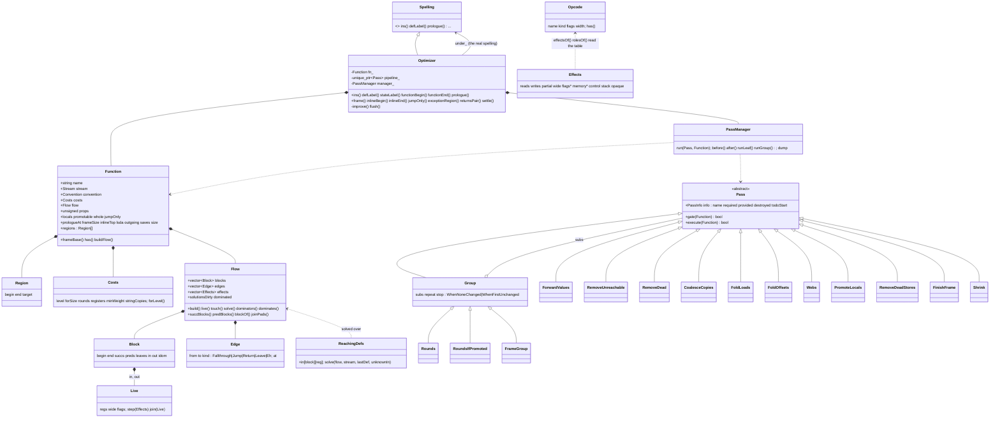

# The optimizer's architecture, after GCC's

Branch `gcc-scheme`, session 1 (Fable 5.1, 2026-09-24). This is the class
diagram the reorganization left, what each class is for, how the pipeline is
declared, how a pass is added, how properties and invalidation work, and how
the levels and costs work. Where it came from is `docs/GCC-SOURCE-STUDY.md`;
what is built on it next is `docs/HANDOVER-SESSION-2.md`. Everything here
emits, byte for byte, what branch `opt` at `c615195` emitted
(`tools/identical.sh`, 2,424 outputs).

## 1. The diagram



Files, all under `src/backend/`:

| File | Holds |
|---|---|
| `OptTable.{h,cpp}` | `Opcode`, `opcodeOf`, the move families, `conditionOf`/`inverse` |
| `OptIr.{h,cpp}` | `Reg`, `Operand`, `Instr`, `Entry`, `Stream` (unchanged) |
| `OptEffects.{h,cpp}` | `Effects`/`Roles` of one instruction from the table; `Convention` |
| `OptCore.h` | `RegSet`, `Effects`, `Control`, `Region`, `EntryOf`, `Edge`, `Live`, `Block`, `FlowOf` (build, liveness, dominators), `removeDeadIn`, `removeUnreachableIn` |
| `OptFlow.{h,cpp}` | `controlOf` for x86; `Flow` = `FlowOf<Entry>` with the x86 effects |
| `OptDataflow.{h,cpp}` | `ReachingDefs` |
| `OptCosts.h` | `Costs` |
| `OptFunction.h` | `Prop`, `Function` |
| `OptPass.{h,cpp}` | `Todo`, `PassInfo`, `Pass`, `Group`, `PassManager`, `dropUnnamedLabels`, `dumpStream` |
| `OptPipeline.{h,cpp}` | the `Pass` subclasses and `pipelineFor()` |
| `OptPasses.h`, `OptValues.cpp`, `OptDead.cpp`, `OptMemory.cpp`, `OptFrame.cpp`, `OptShrink.cpp` | the pass algorithms as free functions (unchanged) |
| `Mir.h`, `MirWebs.cpp` | webs to pseudos and back (`buildWebs`, `assign`) |
| `Optimizer.{h,cpp}` | the Spelling that holds a function, runs the pipeline, replays |

## 2. Each class, and what it is responsible for

**`Optimizer`** (a `Spelling`). Stands in front of the real spelling for -O1
and -O2. Holds every call between `functionBegin` and `functionEnd` as an
`Entry` of the `Function`'s stream - an instruction, a label (with the
state mark), or an *event* (any other spelling call, replayed where it
stood). Takes what the walker says of the function (`frame`, `inlineBegin`,
`jumpOnly`, `returnsPair`, `prologue`). At `functionEnd`, or at `settle`
(the walker about to cut a funclet), `flush` runs the pipeline and replays
the surviving entries. Nothing else: no pass logic lives here any more.

**`Function`.** GCC's `struct function` + `cfg` + `curr_properties`. The
stream, the convention, the costs, the flow, the properties, and the frame
facts (as walked, `frameSize`; as grown by inlined callees, `inlineTop`; as
the passes leave it, `saves` and `size`). `frameBase()` is where the passes
may add slots. A pass reads and writes the function; the manager reads and
writes `props`.

**`Costs`.** The level, in one table (section 6).

**`Flow`** (`FlowOf<Entry>`). The CFG and the scanning layer: `build`
splits the stream into `Block`s at labels and after control instructions,
computes `effects` per entry from the opcode table, and makes the `Edge`s -
jump, fallthrough, return, leave, and `Eh` from every call a `Region`
covers to the block of the region's target (the landing pad, or where the
function resumes after a handler ran as a funclet). GCC ends a block at
such a call; here the call stays in its block - a split would take from
the scalar passes what they know across it, a pushed constant for one -
and the edge records the entry it leaves at (`Edge::at`). Liveness is a
value, `Live` (registers, the ones read wide, the flags), stepped backward
over an instruction's effects; `solve` and every pass that walks a block
backward step the same `Live`, and `joinPads(b, k, live)` adds what a
pad reads at the call that may leave for it, before the call's own effects
kill what it clobbers. `live()`
solves liveness (`liveIn`/`liveOut`, with the `wide` and `flags` bits cxx1
carries) when `solutionsDirty`, and `touch()` sets it dirty; `dominators()`
fills `Block::idom` on request. A rebuild clears both.

**`Block`, `Edge`.** Data; see the diagram. `succs`/`preds` are indices
into `Flow::edges`; `Edge::to == kExit` leaves the function.

**`ReachingDefs`.** A forward dataflow problem: per block and register, the
definitions that may reach the block's entry. The caller numbers the
definitions (`lastDef[entry][reg]`) and says what a block entered from
nowhere holds (`unknownIn[block][reg]`). `buildWebs` is its one client.

**`Opcode`.** One mnemonic's description: `kind` (the effects branch),
`flags` (explicit-only, writes-only, immediate source, renamable frame
operand, shift, zero idiom, merges xmm lanes, leaves flags, forms an
address), `width` (the suffix's). `opcodeOf(m)` looks it up; a prefix family
answers for a spelling not listed.

**`Effects`, `Roles`.** What one instruction reads, writes, writes in
part, reads wide, and does to the flags, memory, control and the stack;
computed by `effectsOf` from the opcode's kind and the operands. Every pass
asks this and nothing else about an instruction's behaviour.

**`Pass`.** `info()` - name, required/provided/destroyed properties, start
TODOs; `gate(fn)`; `execute(fn)` returning whether it changed anything.

**`Group`.** A pass with sub-passes and a repeat policy: `repeat` rounds at
most (0 = the level's `rounds`), stopping `WhenNoneChanged` (a round found
nothing) or `WhenFirstUnchanged` (the round's first sub-pass found nothing,
and the rest of the round is skipped).

**`PassManager`.** `run(pass, fn)`: gate; for a group, the rounds, each
with the group's start TODOs then its subs; for a leaf, the start TODOs, the
`required` check (an assert), `execute`, the property update
`props = (props | provided) & ~destroyed`, `flow.touch()` if it changed,
and the dump if `CXX1_DUMP_MIR` names the pass.

## 3. The pipeline declaration

`OptPipeline.cpp`, `pipelineFor()`:

```
pipeline
  rounds                 [drop-labels, build-flow before each round; repeat costs.rounds; stop when none changed]
    forward-values       requires flow
    remove-unreachable
    remove-dead          requires flow
    coalesce-copies      requires flow
    fold-loads           requires flow
    fold-offsets         requires flow
  frame                  [gate: whole && promotable && prologue held]
    webs                 [build-flow before]; requires flow, physical; provides physical
    promote-locals       requires physical; destroys flow
    rounds               [gate: some local was promoted]
    dse-loop             [repeat 3; stop when the first sub-pass found nothing]
      remove-dead-stores
      rounds
  finish-frame
  shrink-loop            [build-flow before each round; repeat 3; stop when the first sub-pass found nothing]
    shrink               requires flow
    rounds
```

This is exactly the order `Optimizer::improve` ran by hand before, including
two things kept because changing them could change the output: `rounds`
drops unnamed labels before rebuilding the flow, the two loops rebuild
without dropping; and `webs` builds the flow once more even when `rounds`
left it fresh. Both are marked in the source.

## 4. Adding a pass

1. Write the algorithm as a free function over `Stream`/`Flow`/`Convention`
   (or over `Function`) in its own `Opt*.cpp`, returning whether it changed
   anything; ask `effectsOf`, `rolesOf` and `opcodeOf` for anything about an
   instruction, never a mnemonic by name.
2. In `OptPipeline.cpp`, a `struct` deriving from `Pass` with a `PassInfo`:
   its name (also its dump name), what it requires (`kPropFlow` if it reads
   blocks, edges or liveness; `kPropPhysical` if it cannot see a pseudo),
   what it provides and destroys, and `todoStart` if it needs the flow
   rebuilt first. `execute` calls the function; `gate` if it runs only on
   some functions.
3. Add it to the tree in `pipelineFor()` where it belongs. A pass listed in
   more than one place is constructed once per place.
4. Gate: `tools/identical.sh` for a pass meant to change nothing; the suites,
   Compiler++ and the box measurements for one meant to.
5. Read its dump: `CXX1_DUMP_MIR=<name> cxx1.exe -O2 -S x.cpp` prints the
   function after that pass; `all` prints after every pass.

## 5. Properties and invalidation

Two properties exist today:

- `kPropFlow`: `Function::flow` describes `Function::stream` - the blocks'
  ranges are the stream's, the edges are current, the effects are per entry.
  Provided by `Function::buildFlow()` (from a `kTodoBuildFlow`); destroyed by
  `promote-locals`, which inserts entries. Required by every pass that walks
  blocks or asks liveness.
- `kPropPhysical`: no operand names a pseudo. True on entry; `webs` requires
  and re-provides it (it makes pseudos and assigns them back within the
  pass). A session-2 allocator will have `webs` destroy it and the allocator
  provide it, and every pass between will say which it can take.

Invalidation has two levels, as in GCC (`df`'s `solutions_dirty` against
`TODO_cleanup_cfg`):

- **Liveness** is solved on demand (`Flow::live`) and marked dirty by the
  manager after any pass that returned "changed", and by every rebuild. A
  pass that changed nothing leaves it standing, so the next pass's `live()`
  is free. Correct because every pass that edits the stream also edits the
  entry's `effects` (GCC's "immediate rescan"), and reports the change.
- **The flow graph** is rebuilt only where a `kTodoBuildFlow` says so - at
  each round of `rounds` and of the shrink loop, and before `webs` - never
  silently, because the block boundaries a pass sees within a round are part
  of what it does, and a rebuild mid-round would change the output.
  Dominators are cleared by a rebuild and recomputed on the next request.

A pass that needs the flow after another destroyed it is caught by the
`required` assert (`-O2 -g` builds keep asserts), not by a wrong answer.

## 6. Levels and costs

`Costs::forLevel(n)` is the one table: `level`, `forSize` (-O1), and the
numbers the passes read - `rounds`, `registers` and `minWeight` (how many
callee-saved registers locals may take and what earns one), `stringCopies`
(`rep movsq` at -O1, unrolled moves at -O2). Both levels run the same
pipeline; a pass never tests the level, it reads a cost. This is GCC's -Os
against -O2 (the same passes, `optimize_size` changing costs and switching
off the speed-only alignment and layout rows), and cl's /O1 against /O2 (/Os
against /Ot).

What session 2 adds here, per the handover: the inliner's budget (growth
per site, per caller, per unit; `forSize` meaning "only where the body is
no larger than the call"), the allocator's spill and register costs
(references by loop depth for speed, by encoding bytes for size), and the
size-or-speed choice for if-conversion and tail calls.

## 7. What is a documented stub, and what is not built

- `Edge::Eh` edges are made (S2) and liveness takes them; reaching
  definitions still take an Eh edge from its block's end rather than its
  call, which can only join more definitions than reach the pad. The
  frame passes still do not run in a function with landing pads
  (`Function::promotable`): a local kept in a callee-saved register would
  need the unwinder to restore it into the pad, and the prologue's saves
  carry no CFI for that yet.
- `Flow::dominators()` and `dominates()` are built and cleared correctly but
  no pass reads them; session 2's value numbering is their first client.
- `ReachingDefs` has one client (`webs`); def-use chains built from it are
  session 2's.
- `Costs` holds only the fields the passes read today; the inliner and
  allocator fields are named in the handover, not declared.
- The `Opcode` table records today's quirks (`addq` has a width but is not
  arithmetic; `sal`/`rol`/`ror` are shifts but opaque; `testl`/`testq`/`cmpq`
  are not explicit-only) - each a one-line candidate change for session 2,
  each to be measured, none made here.
